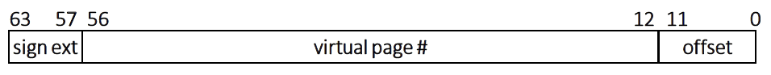
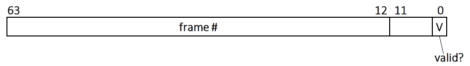

# Introduction
An assignment given as part of the Operating Systems (fall 2024) course - implementing a multi-level page table.

The goal is to implement simulated OS code that handles a multi-level (trie-based) page table. We implement two functions. The first function creates/destroys virtual memory mappings in a page table. The second function checks if an address is mapped in a page table. (The second function is needed if the OS wants to figure out which physical address a process virtual address maps to.)

The code is just a simulation because it will run in a normal process. The files os.c and os.h, contain helper functions that simulate some OS functionality that your pt.c
calls. There’s also a main() function demonstrating usage of the
code.

## Target hardware 
Our simulated OS targets an imaginary 64-bit x86-like CPU. When talking about addresses (virtual or physical), we refer to the least significant bit as bit 0 and to the most significant bit as bit 63.

**Virtual addresses**: The virtual address size of our hardware is 64 bits, of which only the lower 57 bits are used for translation. The top 7 bits are guaranteed to be identical to bit 56, i.e., they are either all ones or all zeroes. The following depicts the virtual address layout:



**Physical addresses**: The physical address size of our hardware is also 64 bits.
Page table structure The page/frame size is 4KB (4096 bytes). Page table nodes occupy a physical page frame, i.e., they are 4KB in size. The size of a page table entry is 64 bits. Bit 0 is the valid bit. Bits 1–11 are unused and must be set to zero. (This means that our target CPU does not implement page access rights.) The top 52 bits contain the page frame number that this entry points to. The following depicts the PTE format:



## OS physical memory manager
The provided os.c contains functions simulating the following functionality: (1) obtain the page number of an unused physical page, which marks it as used; and (2) obtain the kernel virtual address of a given physical address.


1. The following function allocates a physical page (also called *page frame*):\
```uint64 t alloc_page_frame(void);```\
This function returns the ***physical page number*** of the allocated page. There is no need to free physical pages. If alloc page frame() is unable to allocate a physical page, it will exit the program. The content of the allocated page frame is all zeroes.
2. The following function obtains a pointer (i.e., virtual address) to a **physical address**:\
```void* phys_to_virt(uint64 t phys addr);```\
The valid inputs to phys to virt() are addresses that reside in physical pages that were previously returned by alloc page frame(). If it is called with an invalid input, it returns NULL.

# Documentation
We implement the following two functions in a pt.c.

## page_table_update
Creates/destroys virtual memory mappings in a page table:\
```void page_table_update(uint64 t pt, uint64 t vpn, uint64 t ppn);```\
This function takes the following arguments:

- pt: The **physical page number** of the page table root (this is the physical page that the page table base register in the CPU state will point to). You can assume that pt has been previously returned by alloc page frame().
- vpn: The **virtual page number** the caller wishes to map/unmap.
- ppn: Can be one of two cases. If ppn is equal to a special NO_MAPPING value (defined in os.h), then vpn’s mapping (if it exists) should be destroyed. Otherwise, ppn specifies the **physical page number** that vpn should be mapped to.


## page_table_query
Queries the mapping of a virtual page number in a page table:\
```uint64 t page_table_query(uint64 t pt, uint64 t vpn);```\
This function returns the **physical page number** that vpn is mapped to, or NO_MAPPING if no mapping exists. The meaning of the pt argument is the same as with page table update().

# Usage
```
gcc -O3 -Wall -std=c11 os.c pt.c
```