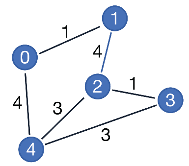
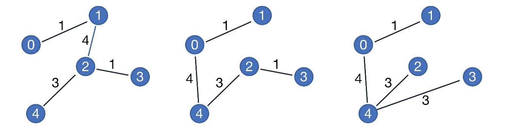
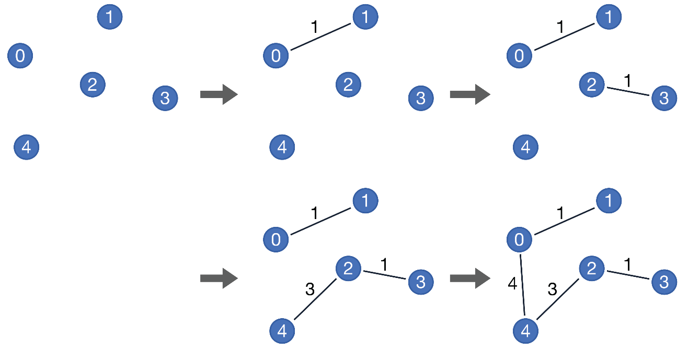

# Introduction
An assignment given as part of the Software 1 (fall 2023) course - implementing greedy algorithms.

The goal is to build a generic platform for solving algorithmic problems according to the greedy method using interfaces. We will use iterators, sorting functions, and generic classes.

## Greedy algorithm
An algorithm is a systematic and unequivocal way of performing a certain task, in a finite number of steps.
Algorithms can be divided into families - according to their way of operation. For example, the family of *recursive* algorithms contains all algorithms that can be implemented recursively. Another example of a family of algorithms is the family of **greedy** algorithms.
A greedy algorithm is one that at every step makes the best possible choice, and does not regret later. This approach seems too simplistic, and of course it is not always correct, but in many cases it finds an optimal solution.
Here we will deal with solving problems where the greedy approach returns an optimal solution.

In general, the greedy algorithm consists of four different functions:
1. **Selection function**: a function that returns the best member (according to the greedy principle).
Should be added .
2. **Feasibility function**: a function that checks whether the addition of the member gives a valid result.
3. **Assign function**: A function that adds a member to the solution.
4. **Solution function**: A function that checks whether a solution is correct.

General pseudo-code for a greedy algorithm:
```
candidates_list = {}
while iterator in selection() has more elements:
    if feasibility(candidates_list, element) is True:
        assign(candidates_list, element):
    if solution(candidates_list) is True:
        return candidates_list
return null
```

We implement the function ```greedyAlgorithm``` in the interface *Greedy* so that any class that implements it can use it. 

### Minimum coin counting 
In the coin counting problem, we have an unlimited supply of 4 types of coins - worth 1, 2, 5, and 10.
As an input to the problem, we will receive a target amount.
A solution to the problem is the amount of coins needed of each type so that the sum of the coins is equal to the target amount.
For example, for input 15, a possible solution to the problem is [0,0,3,0]. That is, 0 coins worth 1, 0 coins worth 2, 3 coins worth 5, and 0 coins worth 10.
Other possible solutions to the problem are [0,0,1,1], [1,7,0,0], and [15,0,0,0] (there are additional solutions).

An optimal solution to the problem would be a solution with a minimal number of coins. That is, a solution in which the sum of the members in the array is minimal. In the example where the input is 15, an optimal solution is [0,0,1,1] (and in particular, in this problem, it is the only optimal solution).
The greedy algorithm for this problem will try to add, as long as the target amount is not exceeded, as many coins as possible of the highest value. It can be proved that for the minimal coin count problem, the greedy algorithm gives an optimal solution.

## Fractional Knapsack
In the knapsack problem we have an inventory of *n* objects. Each object has a weight, and a value. In addition, we have a backpack with limited space for items (capacity). We would like to insert an amount of objects that will not exceed the backpack limit, so that the value of all objects is maximized.
In the fractional version of the problem, the weight of each object (weight) is a decimal number, and we can take only a fraction of it.

We will sort the objects according to their relative weight (value/weight). After that we will go over the objects (in the order in which we sorted them) and add each object in its entirety, as long as it fits inside the backpack. When we reached an object that doesn't fit in the backpack, we will take the relative part of that object that fits into the backpack and update the value of the part that we took.
It can be proved that for the fractional knapsack problem, the greedy algorithm gives an optimal solution. Since the algorithm is greedy, we can adapt it to the general structure we saw:
1. **Selection function**: a function that returns the best member (according to the greedy principle) that should be added. That is, we will return an iterator for the objects so that the relative weight starts from the highest, to the lowest (it can be assumed that the relative weight of all objects is different).
2. **Feasibility function**: a function that checks whether the addition of the member gives a valid result. That is, check if there is still space left in the backpack.
3. **Assign function**: A function that adds a member to the solution. That is, adding an object to the backpack.
4. **Solution function**: A function that checks whether a solution is correct. That is, checking if we have reached the threshold (capacity) of the backpack OR there are no objects left to fill the backpack.


## Minimum spanning tree
Minimum spanning tree:
In the minimal spanning tree problem we need to find a subset of arcs such that:
1. The subgroup is a tree.
2. The subgroup is spanning.
3. The sum of the weights of the sub-group's arcs is minimal.
For example, for the graph:

The next three graphs are spanning trees:

The two left are with minimal weight.

**Kruskal's algorithm**: 
Kruskal's algorithm is a greedy algorithm for solving the problem of finding a minimum spanning tree in an undirected weighted graph.
The algorithm performs:
1. Initialization of an empty array of arcs - candidates.
2. Sorting the arcs by weight, so that the light arcs are first.
3. Going through the arcs (from light to heavy): if the selected arc does not close a circle, we will add it to candidates.
4. We will repeat the previous step until there is an amount of $|𝑉|−1$ arcs in the candidates array.

The algorithm is greedy, because at each step the action that seems optimal at that step is chosen - we take the arc that weighs the least. It can be proved that for the minimal spanning tree problem,
The greedy algorithm gives an optimal solution.


Since Kruskal's algorithm is greedy, we can adapt it to the general structure we saw:
1. **Selection function**: a function that returns the best member (according to the greedy principle) that should be added. That is, we return an iterator for the arcs in the graph so that the weight of the arcs starts from the lowest to the highest.
In addition, for two arcs of the same weight - the tie breaker will be according to the first node in the arch. That is, for two arcs with the same weight, (1,4) will be before (2,3), and (1,3) will be before (1,4).
2. **Feasibility function**: a function that checks whether the addition of the member gives a valid result. That is, check if adding a new arc creates a circle.
3. **Assign function**: A function that adds a member to the solution. That is, adds an arc to the list of arcs which constitute a minimal spanning tree.
4. **Solution function**: A function that checks whether a solution is correct. That is, the function checks whether a group of arcs forms a spanning tree.